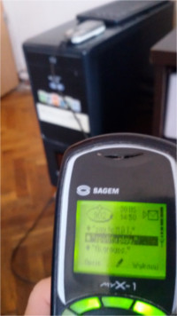
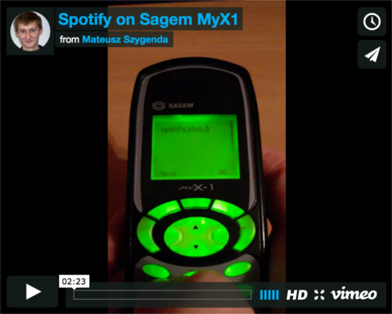
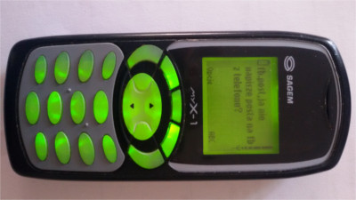
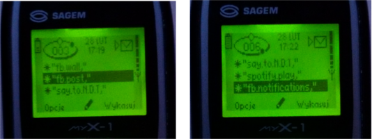
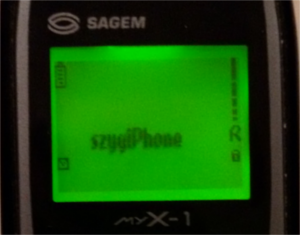
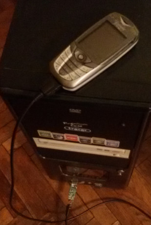

szygiPhone - smartphone for the masses
------------

 

It's an application and **tons** of scripts  which makes old classical mobile phones like Sagem MyX1 (no internet, no MP3, just texts and phone calls) behave like modern smartphone. 

 * [What exactly does it do](#what-exactly-does-it-do)
 * [Why!?](#why)
 * [How does it work](#how-does-it-work)
  * [The Server](#the-server)
  * [szygiPhone](#szygiphone)
  * [Mr. Glue](#mr-glue)
 * [Summary](#summary)
 * [Useful links](#useful-links)

Use at your own risk!
-------------
The project had limited timeframe and was built within just 3-4 days so keep that in mind when you're looking into the code ;-)

What exactly does it do?
-------------
Basically what most people do on their smartphones.

#### Spotify
One thing is that it lets you play some music using spotify :-) You can see it in action on this video 

#### Facebook
And yes, facebook as well! What would people do if they didn't have access to their beloved account. It lets you do the usual stuff like browsing wall, giving likes, commenting posts and checking notifications.

#### Special Feature - Prank Calls
There's also unique feature which can make your friends feel lost/confused. It's able to make a restricted phone call to any number and read sentence you want using voice synthesiser.

All you have to do is to type in the message and a phone number, *szygiPhone* will take care of the rest. You can check how it sounds on [Ivona website](https://www.ivona.com/).

Why!?
--------
Short answer: Because I can. 

There's a longer one (hence limited timeframe for the project), yet short one should be sufficient explanation.

How does it work?
-----------

There are three components which make this all working:

Old mobile phone (Sagem MyX1 AKA *szygiPhone*), The Server and some glue in between.

Like in every Tarantino movie, let's start in the middle.

### The Server

This is the guy which does all the heavy work. Well, at least sometimes. Most of the time it just waits. Waits for messages.

Once it gets a message it checks if it's an interesting one. If it is, it does something interesting as well. This for example may be: posting on a facebook wall or sending back latest comments on your profile picture.

How is it getting those messages? There's another mobile phone connected to it over USB cable.  Server simply pulls all the SMS messages from its inbox.

#### The language

Obviously reading random messages wouldn't be enough. In order to make some meaningful conversation we need common language. The Server knows only one, but at least he's good at it. The language is called "Sagemian" :-)

##### Basics of Sagemian

    SERVICE.COMMAND[.PARAMS],Content

eg.

    fb.post,Nowy post na walla!

Each time it reads a message in that format it starts thinking. First part of this process is to identify piece of functionality it's dealing with. In the example above it knows it has something to do with "Facebook" because it starts with **fb** keyword. 

Once it roughly knows what is it about it tries to interpret what is the specific action (or a command) it should do. In this case we expect it to post a message on a facebook wall.

#### We need some action!

And now we come to the point when server is going to do something useful: Execute the command. There are a lot of commands our server knows but the basic flow is same for most of them.

First, it does the action (like posting on a facebook wall). This is usually trivial thing to do. But that's not all. Usually actions produce results. This for example may be list of latest posts on your facebook wall or identifier of a comment you just created. Wise thing to do would be to send back these results. And that's what The Server do.

For example when it finishes spamming on a wall it sends back local identifier of the post you just created.

eg. 

    fb.post,Some post

Result will be

    Created P0. Some post

It sends back those results as SMS messages using exact same phone it uses for reading. 

But, why would you need responses like that? After all it's pretty obvious you just created a post. Well, one thing is that it works as a confirmation that all went well but more important thing is it includes **local identifier** of the post (`P0`). 

You may use it later on to add comments and give likes as in the examples below.

    fb.comment.0,Nie znam sie to sie wypowiem.
    fb.like.0,

This applies to other facebook responses as well (eg. while you browse the wall each post gets assigned identifier like this).

    # Get latest 5 posts on a wall
    fb.wall.0.5,

    # Response
    P1. Dale Cooper: Damn good cup of coffee.
    P2. John The Revelator: Who's that shouting?
    P3. That guy: Check out that funny cat video!
    ...

Of course as with every rule, there's an exception. It's called Spotify :-)

#### Spotify

This command is a bit different. It doesn't produce any results in form of SMS messages. It streams music over a phone call instead. But how exactly?

Let's start by having a look at example messages

    spotify.play,Breaking the law
    spotify.play,99
    spotify.play,Depeche Mode

As you can see the content of it can be full song name, part of it or even just an artist.

It all starts with getting mp3 file of the song we want. To do that server uses simple tool called `spotify-to-mp3`.

##### Can I call you back?

Immediately after it initiates phone call to *szygiPhone*. It's done by starting background Skype process. This leaves couple of seconds to prepare other things before connection is made.

##### Let's pretend computers can sing
But what are those "other" things you may ask? 

First of all, we need sound. We already have the mp3 file so it starts playing it using `mplayer`. Of course it would be a bit selfish if server played it just for himself. Fortunately for us he's a nice fella. And what it does is that it redirects all the sounds to **virtual microphone**. This way it fools Skype making it believe that he's good at singing.

##### Making it sound right

But that's not the end. As you can imagine phone calls were not invented to stream music. On the way there are various algorithms which attempt to reduce noise so people can communicate easily. If you stream music as is, in most cases it'll be considered as one big noise and it'll be cut off completely. 

Luckily for us, server is aware of that and it uses equaliser to help it a bit. But still, there are couple of quirks around it. Like for example setting it is delayed until connection is made as only then you get the best results.

##### Let's dance!

And that's really it. Equalised music is played and redirected to fake microphone. Skype is making a connection. The only thing left is to answer the call and enjoy music! ;-)

##### Side note about Special Feature

There's another command which works on exact same principles as Spotify but instead of playing music it reads any phrase using voice synthesiser.

eg.

    say.to.+48123123123,You will die in seven days

When server gets this command it generates audio file for the given text. Later on it makes a call to selected number (+48 123 123 123) and it reads the message loudly. 

You can even change the voice (male, female etc.), it's language or number of times it should repeat the message.

The synthesiser it uses is Ivona. You can check how it sounds on their [website](https://www.ivona.com/).

### szygiPhone

Now it's time to talk about the actual classic. The one, and the only *szygiPhone*. It's quite old mobile phone which doesn't let you do much. Simply phone calls and text messages.

You already know that the server can be controlled with SMS messages. The role of the phone is obviously to send them. But not only that. It should also make an impression that all of it is a built-in feature of the phone. There are couple of tricks make it so.

For example there's a menu of all possible commands you can send to server.

All you have to do is to select the right one and fill in the parameters (like post content or a song name). But actually it's nothing more than a list of SMS templates.

The other trick is that the *The Server* appears in contact list as `*`. This makes it the first item in the list so you can quickly send messages just by clicking single button couple of times without even noticing what's happening.

Last but not least is obviously this cool looking logo.

### Mr. Glue

So now you should understand the basic flow. It's time to talk about the nasty details: glue in between. As you may imagine there are a lot of moving parts which makes it work together.

#### Communication

To start of let's talk about the way *szygiPhone* communicates with *The Server*. As mentioned there's mobile phone connected to the PC which runs the server. The one I used was Siemens CX65.

In order to read and send SMS messages I used a project called SCMxx (https://sourceforge.net/projects/scmxx/). It consists of simple command line tool which lets you read various data from siemens phones. To avoid the need of using it directly within a server there are two wrapper scripts: `tools/fetchSms.sh` and `tools/sendSms`.

Those scripts implement generic interface. For example `fetchSms` prints messages in very specific format. 

    SENDER_NUMBER
    ##
    RECEIVER_NUMBER
    ##
    MESSAGE_CONTENT
    ####

So, if you have different mobile phone at hand you can easily plug it into the project by writing your own wrapper scripts.

##### Wrapper scripts for android
Speaking of which, there's another implementation for Android mobile phones included (the reason this implementation exists is a story about luck, clumsiness and saturday morning)

#### Phone Calls: Skype

Crucial thing to make Spotify working was finding a way to stream music over a phone call. Initial idea was just to use a regular PCI modem. But due to lack any of those at hand I started to look for alternatives.

First idea which popped into my head was to use Skype. Apart from VOIP calls it also lets you do regular phone calls. The only problem was to find a way to automate it.

##### Call me!

But, that actually is quite easy to do. To initiate a phone call you just have to run Skype with specific parameter containing the number.

eg.

    $ skype "skype:+48XXXXXXXXX?call"

Unfortunately there's no way you can hang up a call in similar manner. But hey! What the `kill` command is for! ;-)

#### Fake Microphone: PulseAudio

Obviously making phone calls is not enough. We need a way to stream sound over it. The idea is to create something like a *fake microphone* which picks up the sounds from music player for example.

It's really easy to do with PulseAudio server (which is installed on most modern Linux distributions).

Here's how you can set it up
    
    $ pactl load-module module-null-sink sink_name=Virtual2 sink_properties=device.description="Music"
    $ pactl load-module module-loopback sink=Virtual2

This will create **audio input** which is a copy of the **output**. What it means is that any sounds your PC is making will be streamed to this new input. You can think of it as a microphone which records everything inside your computer, and only that.

Once you've done it you only need to change your default microphone input. You can do that using graphical tool like `pavucontrol` or command line `pacmd`.

    $ pacmd set-default-source alsa_output.pci-0000_00_1b.0.analog-stereo.monitor

#### Can I(vona) say something? 

In order to make the "Special Feature" I had to have some voice synthesiser. The obvious choice was to use Ivona as it's the best one (you can see how it sounds on https://www.ivona.com/).

But actually before I used it I first tried some open-source alternatives (like espeak). The reason for that was that there was no easy way to use it without applying for a trial license.

Eventually, due to poor quality of the open-source tools I applied for the trial license and used some python script to access it's API. Basically it calls the remote Ivona service to generate audio file of the given phrase.

#### Other tools

Things described here are just the main parts. There are a lot more smaller scripts which you can find in "tools" folder. If you're interested what each of them does have a look at the [dev guide](DEVGUIDE.md).

### Summary

And so is the end of this short overview of the project called *szygiPhone*. I hope you enjoyed this article as I enjoyed making this project. For me it was really challenging task to put all those pieces together within short period of time, but the end results were definitely worth it :-)

If you're Geeky enough to put your hands on the source code you may find [dev guide](DEVGUIDE.md) useful.

And If you're still here you may want to have a look at my other projects on [github](https://github.com/mszygenda) or [sourceforge](https://sourceforge.net/u/morfeuszpl/profile/).

### Useful links

https://github.com/frosas/spotify-to-mp3

https://sourceforge.net/projects/scmxx/

https://www.ivona.com/pl/

